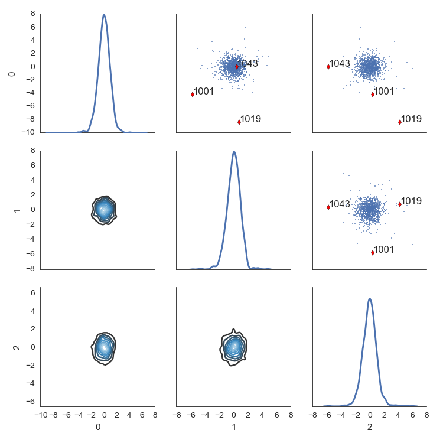

# vizout
Python module that provides a graphical interface to select outliers
in high dimensional data sets interactively. Built on seaborn.


## Example:

```python
import vizout
from scipy.stats import multivariate_normal

# create some Gaussian test data
n = 1000 # number of data points
d = 4 # dimensionality of data
mu = np.zeros((d)) # mean
sigma = np.random.rand(d,d) # std
sigma = np.dot(sigma.transpose(), sigma) # make positive semi-definite
regular_samples = multivariate_normal(mu, sigma).rvs(n)

# add some outliers
m = n / 20
sigma *= 10
outliers = multivariate_normal(mu, sigma).rvs(m)

data_points = np.r_[regular_samples, outliers]

# re-express the data points in terms of the first 3 principal components;
# with only 4 data dimensions, plotting all 4 would not have been a problem,
# but such a dimensionality reduction is useful for very high dimensional data sets
reduced_points = vizout.reduce_dimensionality(data_points, ndim=3, method='pca', whiten=True)

# plot the data points along the first 3 principal components;
selected_indices = vizout.main(reduced_points)

# now select outliers by clicking on them
```


